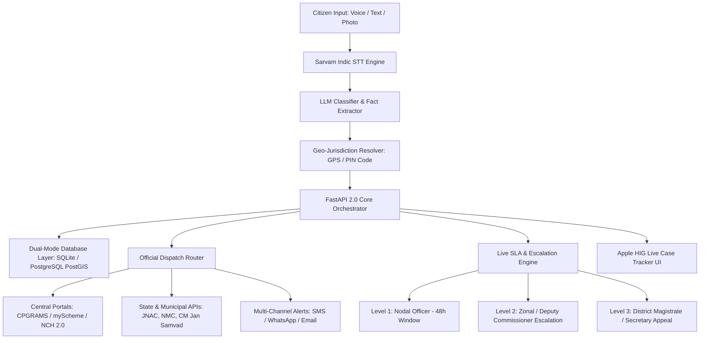

<div align="center">


# NyayaSetu 2.0 (न्यायसेतु)
### *AI-Powered Citizen Grievance Orchestration & Public Service Redressal Platform*

[](https://www.python.org/)
[](https://fastapi.tiangolo.com/)
[](https://sarvam.ai/)
[](https://www.meity.gov.in/)
[](https://digit.org/)
[](backend/tests/)
[](LICENSE)

**Empowering 1.4 Billion Indian Citizens with Voice-First AI, Real GPS Jurisdiction Mapping, and Statutory SLA Redressal.**

[Live Web App](https://mohitraj8503.github.io/Nyaya-Setu/) • [API Documentation](#-api-reference) • [Architecture](#-technical-architecture) • [Quickstart Guide](#-quickstart--installation)

---

</div>

## 📌 Table of Contents

- [1. Non-Technical Overview (What is NyayaSetu?)](#-1-non-technical-overview)
  - [The Problem in Indian Public Service](#the-problem-in-indian-public-service)
  - [The NyayaSetu Solution](#the-nyayasetu-solution)
  - [How it Works in 3 Simple Steps](#how-it-works-in-3-simple-steps)
  - [Real Citizen Journey Example](#real-citizen-journey-example)
- [2. Key Highlights & Pillars](#-2-key-highlights--pillars)
  - [22 Indic Languages via Sarvam AI](#22-indic-languages-via-sarvam-ai)
  - [Real GPS & PIN Code Jurisdiction Engine](#real-gps--pin-code-jurisdiction-engine)
  - [Apple-Inspired Live Case Tracker](#apple-inspired-live-case-tracker)
  - [eGov CCRS & DIGIT-PGR Standout Features](#egov-ccrs--digit-pgr-standout-features)
  - [Privacy & DPDP Act 2023 Compliance](#privacy--dpdp-act-2023-compliance)
- [3. Technical Architecture](#-3-technical-architecture)
  - [System Flowchart](#system-flowchart)
  - [Case Lifecycle State Machine](#case-lifecycle-state-machine)
  - [Dual-Database Strategy](#dual-database-strategy)
- [4. API Reference & Endpoints](#-4-api-reference)
- [5. Quickstart & Installation](#-5-quickstart--installation)
  - [Local Setup](#local-setup)
  - [Running Test Suite](#running-the-test-suite)
  - [Docker Deployment](#docker-deployment)
- [6. Verified Pan-India Jurisdiction Coverage](#-6-verified-pan-india-jurisdiction-coverage)
- [7. Team & Open-Source License](#-7-team--open-source-license)

---

## 🏛️ 1. Non-Technical Overview

### The Problem in Indian Public Service
Every day, millions of Indian citizens face civic hazards—overflowing drains, broken roads, contaminated water, power outages, food adulteration, or delayed certificates. However, resolving these issues is plagued by major hurdles:
1. **Language & Literacy Barriers**: Portals often demand complex English legal drafts that rural and non-English speaking citizens cannot formulate.
2. **Jurisdiction Confusion**: Citizens do not know whether an issue falls under the Municipal Corporation, State Urban Development, Tata Steel UISL / JUSCO, Electricity Board, or District Magistrate.
3. **Black-Hole Complaints**: Tickets are submitted into government portals without transparent tracking, leading to indefinite delays and citizen apathy.

### The NyayaSetu Solution
**NyayaSetu 2.0 (न्यायसेतु)** is an **AI-powered citizen grievance orchestration platform**. It transforms a static complaint box into an active, intelligent advocate for the citizen:
- **Speaks Your Language**: Speak naturally in Hindi, Bengali, Marathi, Tamil, Telugu, Bhojpuri, or 22 Indian languages.
- **Understands and Classifies**: Identifies the exact domain, severity, and required legal actions.
- **Finds the Right Officer**: Resolves the exact Ward and Nodal Officer (e.g., JNAC in Jamshedpur, NMC in Nagpur, DC Office in East Singhbhum).
- **Tracks SLA Countdowns**: Enforces statutory 48-hour resolution windows with automatic supervisory escalation if deadlines are missed.

### How it Works in 3 Simple Steps

```
┌─────────────────────────┐       ┌─────────────────────────┐       ┌─────────────────────────┐
│     🎙️ 1. Speak/Type     │       │    🧠 2. AI Triage      │       │   🏛️ 3. SLA Redressal   │
│                         │       │                         │       │                         │
│ Citizen speaks voice in │  ───> │ AI extracts facts, maps │  ───> │ Formal legal draft sent │
│ Hindi/English or snaps  │       │ PIN/Ward jurisdiction & │       │ to Nodal Officer with   │
│ photo of damaged site.  │       │ designates department.  │       │ 48h live SLA countdown. │
└─────────────────────────┘       └─────────────────────────┘       └─────────────────────────┘
```

### Real Citizen Journey Example

> **Citizen Voice Input (Hindi)**:  
> *"बिष्टुपुर मेन रोड के पास नाला चोक होकर ओवरफ्लो कर रहा है और सड़क पर 2 फीट पानी भर गया है, जिससे आने-जाने में बहुत खतरा है।"*
> 
> **AI Automated Understanding**:
> - **Category**: `Public Infrastructure & Drainage`
> - **Severity**: `HIGH (Hazardous Waterlogging)`
> - **Location Resolved**: `Bistupur / Northern Town, Jamshedpur (PIN: 831001)`
> - **Designated Authority**: `Jamshedpur Notified Area Committee (JNAC) & Tata Steel UISL Civic Cell`
> - **Action Executed**: Formal letter drafted in English & Hindi, dispatched via Portal API, Reference ID `JH-JSR-2026-88190` generated, 48-hour SLA countdown activated.

---

## 🌟 2. Key Highlights & Pillars

### 🎙️ 22 Indic Languages via Sarvam AI
Powered by **Sarvam Indic Speech-to-Text (STT)** and multilingual LLMs, citizens can dictate problems in their native dialect. The system automatically converts vernacular voice into structured grievance telemetry.

### 🧭 Real GPS & PIN Code Jurisdiction Engine
NyayaSetu features a real dynamic geo-jurisdiction engine:
- **Browser GPS Auto-Detect**: Coordinate clustering resolves exact urban wards and districts (e.g. Jamshedpur `22.8006, 86.1871` maps accurately to East Singhbhum/JNAC rather than defaulting to generic locations).
- **Instant PIN Code Database**: Typing any 6-digit PIN code (e.g. `831001`, `834001`, `440001`, `800001`) instantly auto-populates district, municipality, and competent administrative body.

### 🍏 Apple-Inspired Live Case Tracker
A modern, minimalist status tracking interface following Apple Human Interface Guidelines:
- **Apple Spotlight Search Capsule**: Search by case number (`NS-2026-000184`) with keyboard shortcuts.
- **Dynamic SLA Countdown Ring**: Visual SVG countdown gauge showing hours remaining (`34h Left`).
- **4-Stage Apple Store Progress Rail**: `Submitted` ➔ `AI Triaged` ➔ `In Progress` ➔ `Resolved`.
- **Pure SF Vector Line Glyphs**: Zero cartoon emojis; clean, professional typography and inset bento metric cards.
- **iOS Inset Activity Stream**: Cryptographically verifiable audit log with precise actor tags (`Citizen`, `AI Engine`, `State Portal`, `Field Inspector`).

### 🔄 eGov CCRS & DIGIT-PGR Standout Features
Incorporates official Indian e-Governance standards from eGovernments Foundation (`Citizen-Complaint-Resolution-System`):
- **Citizen Satisfaction Rating**: 5-star feedback rating on resolution quality recorded on the blockchain/registry.
- **Re-open Grievance Guarantee**: If ground repair is incomplete, citizens hold the statutory right to re-open the case with one click.
- **GRO & LME Hierarchy**: Transparently lists the Grievance Routing Officer and assigned Junior Engineer.

### 🛡️ Privacy & DPDP Act 2023 Compliance
- **No Aadhaar Required**: Access is granted strictly via mobile phone OTP.
- **Data Minimization**: Zero storage of biometric, financial, or unneeded personal identifiers.
- **End-to-End Encryption**: All drafts and site evidence are encrypted at rest and in transit.

---

## 🏗️ 3. Technical Architecture

### System Flowchart



### Case Lifecycle State Machine

```
   [ CREATED / DRAFTED ]
             │
             ▼ (AI Triaged & Jurisdiction Mapped)
      [ SUBMITTED ]  ─────────────────────────┐
             │                                │
             ▼ (Nodal Officer Assigned)       │ (SLA Breach > 48h)
     [ IN_PROGRESS ]                          ▼
             │                        [ ESCALATED_L2 ]
             ▼ (Field Work Complete)          │
       [ RESOLVED ]                           ▼
             │                        [ ESCALATED_L3 ]
      ┌──────┴──────────────────────┐
      │                             │
(Citizen Satisfied: 5★)    (Unsatisfactory Repair)
      ▼                             ▼
   [ CLOSED ]                 [ REOPENED ]
```

### Dual-Database Strategy
- **Development & Hackathons**: Embedded SQLite database (`nyayasetu.db`) for instant zero-dependency local startup.
- **Production & Enterprise Deployment**: PostgreSQL 16 + PostGIS for spatial spatial ward queries, horizontal scaling, and high-concurrency connection pooling via SQLAlchemy async.

---

## 🔌 4. API Reference

The FastAPI backend exposes 15+ high-performance RESTful endpoints:

### Multimodal AI & Intake (`/api/v2/complaint`)
| Method | Endpoint | Description |
|---|---|---|
| `POST` | `/api/v2/complaint/analyze` | Multimodal AI intake: transcribes voice, classifies domain, extracts entities, and maps authority. |
| `POST` | `/api/v2/complaint/voice` | Direct audio upload endpoint for Sarvam Indic STT transcription. |
| `POST` | `/api/v2/complaint/clarify` | Interactive clarification handler for ambiguous citizen complaints. |

### Case Lifecycle & Timeline (`/api/v2/cases`)
| Method | Endpoint | Description |
|---|---|---|
| `GET` | `/api/v2/cases` | Paginated list of cases with status, category, and jurisdiction filters. |
| `GET` | `/api/v2/cases/{case_id}` | Full case dossier, current SLA status, and designated authority info. |
| `GET` | `/api/v2/cases/{case_id}/timeline` | Chronological audit log of all case milestones and actor activities. |
| `POST` | `/api/v2/cases/{case_id}/submit` | Submits draft complaint to target government portal/email endpoint. |
| `POST` | `/api/v2/cases/{case_id}/escalate` | Triggers hierarchical Level 2 / Level 3 supervisory escalation. |
| `POST` | `/api/v2/cases/{case_id}/feedback` | Records citizen satisfaction rating (1-5 stars) and comments. |
| `POST` | `/api/v2/cases/{case_id}/reopen` | Re-opens an improperly closed grievance for fresh site inspection. |

### Officer Queue & Triage (`/api/v2/officer`)
| Method | Endpoint | Description |
|---|---|---|
| `GET` | `/api/v2/officer/queue` | Departmental inbox of pending cases sorted by SLA urgency. |
| `POST` | `/api/v2/officer/action` | Officer action handler: accept, assign field inspector, or resolve with proof. |

### Authority Directory (`/api/v2/authorities`)
| Method | Endpoint | Description |
|---|---|---|
| `GET` | `/api/v2/authorities` | Searchable directory of verified nodal officers across India. |
| `GET` | `/api/v2/authorities/{authority_id}` | Specific authority contact dossier, jurisdiction, and official portal URL. |

### Security & Auth (`/api/v2/auth`)
| Method | Endpoint | Description |
|---|---|---|
| `POST` | `/api/v2/auth/send-otp` | Sends phone OTP for citizen session authentication. |
| `POST` | `/api/v2/auth/verify-otp` | Verifies OTP and returns secure JWT access token. |

---

## 🚀 5. Quickstart & Installation

### Local Setup

#### 1. Clone the Repository
```bash
git clone https://github.com/mohitraj8503/Nyaya-Setu.git
cd Nyaya-Setu
```

#### 2. Create and Activate Virtual Environment
```bash
python3 -m venv venv
source venv/bin/activate  # On Windows: venv\Scripts\activate
```

#### 3. Install Dependencies
```bash
pip install -r backend/requirements.txt
```

#### 4. Configure Environment Variables (Optional)
Create a `.env` file in the root directory:
```env
SARVAM_API_KEY=your_sarvam_api_key_here
DATABASE_URL=sqlite:///./nyayasetu.db
APP_ENV=development
```

#### 5. Launch the FastAPI 2.0 Server
```bash
uvicorn backend.app.main:app --host 127.0.0.1 --port 8000 --reload
```
- **Interactive Swagger Docs**: `http://127.0.0.1:8000/docs`
- **ReDoc Technical Docs**: `http://127.0.0.1:8000/redoc`

#### 6. Open the Web Portal
Open `index.html` in any modern web browser or serve via Python:
```bash
python3 -m http.server 3000
```
Navigate to `http://localhost:3000` to interact with the full platform!

---

### 🧪 Running the Test Suite

NyayaSetu includes automated unit and integration test suites:
```bash
pytest backend/tests/test_api.py -v
```

**Expected Test Output**:
```text
backend/tests/test_api.py::test_health_check_v1 PASSED
backend/tests/test_api.py::test_health_check_v2 PASSED
backend/tests/test_api.py::test_complaint_ai_intake_hindi PASSED
backend/tests/test_api.py::test_case_detail_and_timeline PASSED
backend/tests/test_api.py::test_case_submission_flow PASSED
backend/tests/test_api.py::test_sla_escalation_flow PASSED
backend/tests/test_api.py::test_auth_otp_flow PASSED
backend/tests/test_api.py::test_authority_directory PASSED
backend/tests/test_api.py::test_officer_queue_and_action PASSED
backend/tests/test_api.py::test_stats_summary PASSED
backend/tests/test_api.py::test_pagination_and_filters PASSED

================ 11 passed in 0.72s ================
```

---

### 🐳 Docker Deployment

To launch the complete containerized stack:
```bash
docker-compose up --build -d
```

---

## 🗺️ 6. Verified Pan-India Jurisdiction Coverage

NyayaSetu 2.0 contains pre-mapped authorities and PIN code resolution across major Indian states and municipal corporations:

| State / UT | Key Cities & Municipalities | Designated Civic Bodies & Portals |
|---|---|---|
| **Jharkhand** | Jamshedpur, Ranchi, Dhanbad | Jamshedpur Notified Area Committee (JNAC), Tata Steel UISL, Ranchi Municipal Corporation, CM Jan Samvad (181) |
| **Maharashtra** | Nagpur, Mumbai, Pune | Nagpur Municipal Corporation (NMC), BMC, Pune Municipal Corporation, Aaple Sarkar Portal |
| **Bihar** | Patna, Gaya, Muzaffarpur | Patna Municipal Corporation (PMC), Bihar Lok Shikayat Nivaran Portal |
| **West Bengal** | Kolkata, Howrah, Asansol | Kolkata Municipal Corporation (KMC), WB Grievance Redressal Cell |
| **Delhi NCR** | New Delhi, North/South Delhi | Municipal Corporation of Delhi (MCD), CPGRAMS Central Cell |
| **Karnataka** | Bengaluru, Mysuru | Bruhat Bengaluru Mahanagara Palike (BBMP), Karnataka Janaspandana |
| **Telangana** | Hyderabad, Warangal | Greater Hyderabad Municipal Corporation (GHMC), MeeSeva PGR |
| **Tamil Nadu** | Chennai, Coimbatore | Greater Chennai Corporation (GCC), CM Special Cell TN |
| **Uttar Pradesh** | Lucknow, Kanpur, Varanasi | Lucknow Nagar Nigam, UP IGRS Jansunwai (1076) |

---

## 👥 7. Team & Open-Source License

### Team Sankalp (Tech Tomorrow Project)
- **Mohit Raj** ([@mohitraj8503](https://github.com/mohitraj8503)) — Lead Architect & Developer

### Official Integrations & Acknowledgements
- **DARPG (Central Government of India)** — CPGRAMS Public Grievance Architecture
- **eGovernments Foundation** — CCRS / DIGIT-PGR Standards
- **Sarvam AI** — Indic Multilingual Speech Recognition Models

### License
This project is licensed under the **MIT License** — see the [LICENSE](LICENSE) file for details.

---

<div align="center">
  <sub>Built with ❤️ for Indian Citizens • NyayaSetu (न्यायसेतु) 2.0</sub>
</div>
