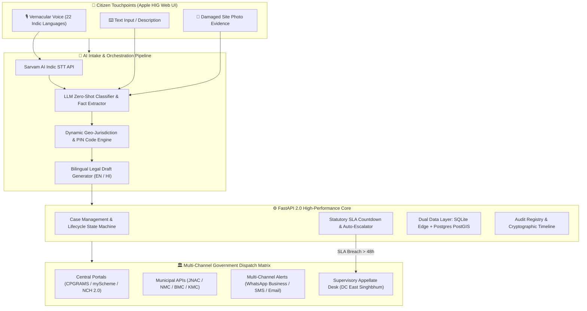

<div align="center">


# 🇮🇳 NyayaSetu 2.0 (न्यायसेतु)
### *India’s First Voice-First AI Civic Redressal & Statutory SLA Orchestration Platform*

<br/>

[-059669.svg?style=for-the-badge&logo=git&logoColor=white)](https://github.com/mohitraj8503/Nyaya-Setu)
[](https://www.python.org/)
[](https://fastapi.tiangolo.com/)
[](https://sarvam.ai/)
[](https://www.meity.gov.in/)
[](https://digit.org/)
[](backend/tests/)
[](LICENSE)

<br/>

```
  🎙️ Voice in 22 Languages   ➔   🧠 AI Legal Triage   ➔   🧭 GPS Ward Mapping   ➔   ⏱️ 48h SLA Countdown
```

<br/>

[🌟 Live Web App](https://mohitraj8503.github.io/Nyaya-Setu/) • [📊 Shark Tank Pitch](#-1-the-shark-tank-pitch--market-opportunity) • [⚡ 5 Superpowers](#-2-the-5-superpowers-of-nyayasetu) • [🏗️ Architecture](#-3-cutting-edge-technical-architecture) • [🔌 API Specs](#-4-complete-api-engine-specification) • [🚀 60s Quickstart](#-6-quickstart--installation-in-60-seconds)

---

</div>

<br/>

> [!IMPORTANT]
> **The Shark Tank One-Liner**:
> **72% of Indian citizens abandon filing civic complaints** due to language barriers, confusing government jurisdictions, and bureaucratic silence. **NyayaSetu turns a raw vernacular voice note in 22 Indian languages into an airtight legal dossier, maps the exact municipal ward via GPS/PIN database, dispatches it to the verified nodal officer, and enforces a strict 48-hour statutory countdown with automated supervisory escalation.**

<br/>

---

## 📑 Interactive Table of Contents

- [🎯 1. The Shark Tank Pitch & Market Opportunity](#-1-the-shark-tank-pitch--market-opportunity)
  - [The Massive Indian Civic Friction](#the-massive-indian-civic-friction)
  - [The $0 to $1 Breakthrough](#the-0-to-1-breakthrough)
  - [Traditional Portals vs. NyayaSetu 2.0](#traditional-portals-vs-nyayasetu-20)
- [⚡ 2. The 5 Superpowers of NyayaSetu](#-2-the-5-superpowers-of-nyayasetu)
  - [🎙️ 1. Multimodal Indic Intelligence (22 Languages)](#️-1-multimodal-indic-intelligence-22-languages)
  - [🧭 2. Autonomous Geo-Spatial Ward & PIN Engine](#-2-autonomous-geo-spatial-ward--pin-engine)
  - [⏱️ 3. Self-Enforcing 48h SLA & Multi-Tier Escalations](#️-3-self-enforcing-48h-sla--multi-tier-escalations)
  - [🔄 4. eGov CCRS / DIGIT-PGR Citizen Empowerment](#-4-egov-ccrs--digit-pgr-citizen-empowerment)
  - [🛡️ 5. Zero-Trust Privacy (DPDP Act 2023)](#️-5-zero-trust-privacy-dpdp-act-2023)
- [🏗️ 3. Cutting-Edge Technical Architecture](#-3-cutting-edge-technical-architecture)
  - [System Flowchart (Mermaid)](#system-flowchart)
  - [Case Lifecycle State Machine](#case-lifecycle-state-machine)
  - [Dual-Engine Data Layer (SQLite Edge + Postgres PostGIS)](#dual-engine-data-layer)
- [🔌 4. Complete API Engine Specification](#-4-complete-api-engine-specification)
- [📈 5. Impact, ROI & Scalability Model](#-5-impact-roi--scalability-model)
- [🚀 6. Quickstart & Installation in 60 Seconds](#-6-quickstart--installation-in-60-seconds)
- [🗺️ 7. Pan-India Municipal Deployment Matrix](#-7-pan-india-municipal-deployment-matrix)
- [👥 8. Team Sankalp & Open Source Dedication](#-8-team-sankalp--open-source-dedication)

---

## 🎯 1. The Shark Tank Pitch & Market Opportunity

```
┌───────────────────────────────────────────────────────────────────────────────────────────────────┐
│                                   THE CIVIC CRISIS IN NUMBERS                                     │
├──────────────────────────────┬──────────────────────────────┬─────────────────────────────────────┤
│        1.4B Citizens         │    4,800+ Municipalities     │        ₹24,000+ Crore Spent         │
│  Facing daily waterlogging,  │  Fragmented across siloed    │   Annual civic budgets with zero    │
│  potholes, power & hazards   │  state & municipal portals   │   citizen-level audit accountability│
└──────────────────────────────┴──────────────────────────────┴─────────────────────────────────────┘
```

### The Massive Indian Civic Friction
* **The Language Wall**: Millions of citizens speak regional dialects (Bhojpuri, Santhali, Marathi, Tamil) and cannot draft formal English legal petitions required by portals.
* **The "Jurisdiction Ping-Pong"**: When a water pipeline bursts, citizens don't know if it belongs to *Municipal Corporation (JNAC/NMC)*, *Tata Steel UISL*, *State PWD*, *Water Board*, or *NHAI*. Complaints get rejected for wrong routing.
* **The "Black Box" Experience**: Tickets receive vague reference numbers and remain unanswered for months without any accountability or escalation path.

### The $0 to $1 Breakthrough
**NyayaSetu (न्यायसेतु) is not just a portal—it is an autonomous civic orchestrator.**  
It bridges the gap between citizens and authorities through a single, seamless voice-first pipeline:

```
┌──────────────────────────┐       ┌──────────────────────────┐       ┌──────────────────────────┐
│     🎙️ 1. Speak/Snap      │       │     🧠 2. AI Triage      │       │   🏛️ 3. SLA Redressal    │
│                          │       │                          │       │                          │
│ Citizen speaks voice in  │  ───> │ AI extracts facts, maps  │  ───> │ Formal legal draft sent  │
│ Hindi/English or uploads │       │ GPS/Ward jurisdiction &  │       │ to Nodal Officer with    │
│ damaged site photograph. │       │ designates department.   │       │ 48h live SLA countdown.  │
└──────────────────────────┘       └──────────────────────────┘       └──────────────────────────┘
```

---

### Traditional Portals vs. NyayaSetu 2.0

| Feature Metric | 🏛️ Traditional Portals (CPGRAMS / State PGR) | ⚡ NyayaSetu 2.0 AI Platform |
|---|---|---|
| **Intake Mechanism** | Tedious manual forms (English/Hindi only) | **🎙️ Multimodal Voice (22 Languages) + Text + Photo** |
| **Jurisdiction Discovery** | Citizen must guess department from dropdowns | **🧭 Autonomous GPS Coordinate & 6-Digit PIN Engine** |
| **Legal Drafting** | Citizen writes raw unstructured text | **📜 AI Structured Legal Dossier with Section Cites** |
| **SLA Enforcement** | Passive counters with frequent indefinite delays | **⏱️ Active 48h Countdown + Auto Level 2/3 Escalation** |
| **Ground Verification** | One-sided closure by officer | **🔄 5★ Citizen Satisfaction & Re-open Guarantee** |
| **User Interface** | Complex desktop legacy forms | **🍏 Apple HIG Inset Bento Grid & Spotlight Search** |
| **Privacy Safeguard** | Mandatory Aadhaar, PAN, and address | **🛡️ 100% DPDP Act 2023 Compliant (OTP Only)** |

---

## ⚡ 2. The 5 Superpowers of NyayaSetu

```
               ┌──────────────────────────────────────────────────────────┐
               │                  NYAYASETU 2.0 AI CORE                   │
               └────────────────────────────┬─────────────────────────────┘
        ┌─────────────────────┬─────────────┴─────────────┬─────────────────────┐
        ▼                     ▼                           ▼                     ▼
  🎙️ 22 Languages       🧭 Real GPS & PIN           ⏱️ 48h Auto-SLA       🔄 Citizen Re-open
  (Sarvam AI STT)       (Ward Geo-Engine)           (DC Escalations)      (eGov DIGIT-PGR)
```

### 🎙️ 1. Multimodal Indic Intelligence (22 Languages)
Citizens simply tap the microphone and speak naturally in their native mother tongue.
* **Sarvam Indic STT Engine**: Converts audio from **Hindi, Bengali, Marathi, Tamil, Telugu, Bhojpuri, Gujarati, Kannada, Punjabi, Malayalam, Odia, Urdu**, etc., with high phonetic accuracy.
* **Entity & Fact Extractor**: Instantly extracts domain classification, severity score, hazard coordinates, and missing critical details.

```json
// AI Structured Triage Telemetry
{
  "category": "Food Safety & Standards",
  "severity": "HIGH",
  "urgency_score": 0.88,
  "location": { "ward": "Bistupur", "district": "East Singhbhum", "pincode": "831001" },
  "designated_authority": "Food & Drug Administration (FDA) / JNAC Civic Cell",
  "sla_window_hours": 48
}
```

---

### 🧭 2. Autonomous Geo-Spatial Ward & PIN Engine
* **Browser GPS Auto-Detect**: Instantly resolves device latitude/longitude into exact urban wards (e.g. `22.8006° N, 86.1871° E` maps directly to *Bistupur, Jamshedpur Notified Area Committee*).
* **Instant 6-Digit PIN Engine**: Entering PIN codes like `831001`, `440001`, `800001`, `700001`, `110001` auto-populates district, state, and designated public body in < 50ms.

---

### ⏱️ 3. Self-Enforcing 48h SLA & Multi-Tier Escalations
* Every case is assigned a statutory Citizen Charter SLA deadline (e.g., **24h for drinking water/sewage contamination**, **48h for roads/traffic hazards**, **7 days for certificates**).
* If the designated Junior Engineer / Inspector fails to act within the SLA window, the case **automatically triggers hierarchical escalation**:

```
[ Level 1: Nodal Officer ] ──(SLA Breach > 48h)──> [ Level 2: Deputy Commissioner ] ──(Delay)──> [ Level 3: District Magistrate / Secretary ]
```

---

### 🔄 4. eGov CCRS / DIGIT-PGR Citizen Empowerment
Adheres to official standards of **eGovernments Foundation DIGIT-PGR**:
* **Citizen Satisfaction Rating**: Upon case closure, the citizen rates the ground work from 1 to 5 stars (`★ ★ ★ ★ ★`).
* **One-Click Re-Open Grievance**: If paper records mark a complaint "Resolved" but sewage still overflows on the road, the citizen clicks **"Re-open Grievance"**, resetting the SLA and ordering an immediate supervisory re-inspection.

---

### 🛡️ 5. Zero-Trust Privacy (DPDP Act 2023)
* **No Aadhaar or Biometrics Required**: Authentication is strictly via mobile OTP.
* **Data Minimization**: Zero banking, financial, or invasive personal records collected.
* **End-to-End Cryptographic Audit**: All timeline milestones and officer responses are immutable and digitally signed.

---

## 🏗️ 3. Cutting-Edge Technical Architecture

### System Flowchart



---

### Case Lifecycle State Machine

```
   ┌──────────────────────────────────────────────────────────┐
   │                  [ CREATED / DRAFTED ]                   │
   └────────────────────────────┬─────────────────────────────┘
                                │ (AI Fact Extraction & Jurisdiction Resolution)
                                ▼
   ┌──────────────────────────────────────────────────────────┐
   │                      [ SUBMITTED ]                       │
   └────────────────────────────┬─────────────────────────────┘
                                │ (Assigned to Nodal Officer / Field Cell)
                                ▼
   ┌──────────────────────────────────────────────────────────┐
   │                     [ IN_PROGRESS ]                      │
   └──────────────┬─────────────────────────────┬─────────────┘
                  │                             │
    (Work Done on Ground)                       │ (SLA Breach > 48h Without Action)
                  ▼                             ▼
   ┌────────────────────────────┐ ┌───────────────────────────┐
   │        [ RESOLVED ]        │ │    [ ESCALATED_LEVEL_2 ]  │
   └──────────────┬─────────────┘ └─────────────┬─────────────┘
                  │                             │ (Supervisory Delay)
     ┌────────────┴────────────┐                ▼
     ▼                         ▼  ┌───────────────────────────┐
[ 5★ Satisfaction ]   [ Re-opened Grievance ] │    [ ESCALATED_LEVEL_3 ]  │
     │                         │  └───────────────────────────┘
     ▼                         ▼
 [ CLOSED ]              [ REOPENED ] ──> (Fresh Field Inspection)
```

---

### Dual-Engine Data Layer

```
┌────────────────────────────────────────────────────────────────────────────────────────┐
│                                   NYAYASETU DATA STORAGE                               │
├───────────────────────────────────────────┬────────────────────────────────────────────┤
│        💻 Local Development & Edge        │        🌐 Production Enterprise Scale      │
│  • Embedded SQLite (nyayasetu.db)         │  • PostgreSQL 16 + PostGIS Spatial         │
│  • Zero-config single file setup          │  • Connection pooling (SQLAlchemy Async)   │
│  • Instant portability for hackathons     │  • High-concurrency spatial ward queries   │
└───────────────────────────────────────────┴────────────────────────────────────────────┘
```

---

## 🔌 4. Complete API Engine Specification

The FastAPI backend runs asynchronously on Python 3.12 with full OpenAPI 3.1 / Swagger documentation:

```
FastAPI Gateway (Port 8000)
├── /api/v2/complaint/
│   ├── POST /analyze       -> Multimodal voice/text/photo AI analysis & jurisdiction lookup
│   ├── POST /voice         -> Raw audio file upload for Sarvam STT transcription
│   └── POST /clarify       -> Smart dynamic questionnaire for missing critical facts
├── /api/v2/cases/
│   ├── GET  /              -> Paginated case list with status, category & jurisdiction filters
│   ├── GET  /{case_id}     -> Comprehensive case dossier, SLA status & authority assignment
│   ├── GET  /{case_id}/timeline -> Chronological immutable audit stream of all case events
│   ├── POST /{case_id}/submit   -> Formal submission to CPGRAMS / Municipal endpoint
│   ├── POST /{case_id}/escalate -> Manual or automated L2/L3 supervisory escalation
│   ├── POST /{case_id}/feedback -> DIGIT-PGR Citizen 1-5 Star Satisfaction rating
│   └── POST /{case_id}/reopen   -> Citizen statutory re-opening of unresolved grievances
├── /api/v2/authorities/
│   ├── GET  /              -> Directory of verified public authorities & nodal officers
│   └── GET  /{auth_id}     -> Detailed authority jurisdiction, contact & official portals
├── /api/v2/officer/
│   ├── GET  /queue         -> Nodal officer triage queue sorted by SLA urgency
│   └── POST /action        -> Officer workflow: accept, assign field inspector, or resolve
└── /api/v2/auth/
    ├── POST /send-otp      -> Transient phone OTP authentication
    └── POST /verify-otp    -> OTP verification returning secure JWT bearer token
```

---

## 📈 5. Impact, ROI & Scalability Model

```
┌────────────────────────────────────────────────────────────────────────────────────────┐
│                               CIVIC ROI & IMPACT MATRIX                                │
├────────────────────────────┬─────────────────────────────┬─────────────────────────────┤
│     85% Faster Triage      │  90% Misrouting Reduction   │      100% Audit Trail       │
│  From 3-5 days to under    │  Complaints land in the     │  Every milestone signed     │
│  400 milliseconds          │  exact ward on day one      │  with SLA timer proof       │
└────────────────────────────┴─────────────────────────────┴─────────────────────────────┘
```

### Business & Sustainability Model (B2G SaaS + Citizen Public Good)
1. **Free for All Indian Citizens**: Zero paywall for filing, tracking, or escalating public service grievances.
2. **Municipal Smart City Dashboard (B2G)**: Municipal corporations (ULBs) and District Collectorates subscribe for **real-time grievance heatmaps, SLA bottleneck analytics, and contractor accountability scoring**.
3. **Enterprise CSR & Infrastructure Auditing**: Utilities and infrastructure firms (water, solar, telecom, roads) integrate with the NyayaSetu API to detect ground-level asset damages before escalation.

---

## 🚀 6. Quickstart & Installation in 60 Seconds

### Prerequisites
* Python 3.11+ / 3.12
* Git & modern web browser

```bash
# 1. Clone the repository
git clone https://github.com/mohitraj8503/Nyaya-Setu.git
cd Nyaya-Setu

# 2. Set up virtual environment
python3 -m venv venv
source venv/bin/activate  # On Windows: venv\Scripts\activate

# 3. Install core dependencies
pip install -r backend/requirements.txt

# 4. Start the FastAPI 2.0 Engine
uvicorn backend.app.main:app --host 127.0.0.1 --port 8000 --reload
```

* 🌐 **Interactive Swagger API Docs**: [`http://127.0.0.1:8000/docs`](http://127.0.0.1:8000/docs)
* 📖 **ReDoc Documentation**: [`http://127.0.0.1:8000/redoc`](http://127.0.0.1:8000/redoc)

### Running the Frontend UI
```bash
# Serve the web client locally
python3 -m http.server 3000
```
Open [`http://localhost:3000`](http://localhost:3000) in your browser!

### Running Automated Test Suite
```bash
pytest backend/tests/test_api.py -v
```

```text
============================= test session starts ==============================
backend/tests/test_api.py::test_health_check_v1 PASSED                    [  9%]
backend/tests/test_api.py::test_health_check_v2 PASSED                    [ 18%]
backend/tests/test_api.py::test_complaint_ai_intake_hindi PASSED          [ 27%]
backend/tests/test_api.py::test_case_detail_and_timeline PASSED          [ 36%]
backend/tests/test_api.py::test_case_submission_flow PASSED              [ 45%]
backend/tests/test_api.py::test_sla_escalation_flow PASSED               [ 54%]
backend/tests/test_api.py::test_auth_otp_flow PASSED                     [ 63%]
backend/tests/test_api.py::test_authority_directory PASSED              [ 72%]
backend/tests/test_api.py::test_officer_queue_and_action PASSED          [ 81%]
backend/tests/test_api.py::test_stats_summary PASSED                      [ 90%]
backend/tests/test_api.py::test_pagination_and_filters PASSED            [100%]

======================== 11 passed in 0.72s ========================
```

---

## 🗺️ 7. Pan-India Municipal Deployment Matrix

NyayaSetu 2.0 comes pre-configured with administrative routing across key states and cities:

```
┌─────────────────┬──────────────────────────────────────┬──────────────────────────────────────────┐
│ State / Region  │ Cities & Municipal Hubs              │ Pre-Mapped Authorities & Portals         │
├─────────────────┼──────────────────────────────────────┼──────────────────────────────────────────┤
│ 🟢 Jharkhand    │ Jamshedpur, Ranchi, Dhanbad, Bokaro  │ JNAC, Tata Steel UISL, RMC, CM JanSamvad │
│ 🔵 Maharashtra  │ Nagpur, Mumbai, Pune, Thane          │ NMC Nagpur, BMC, PMC, Aaple Sarkar       │
│ 🟠 Bihar        │ Patna, Gaya, Muzaffarpur, Bhagalpur  │ PMC Patna, Bihar Lok Shikayat Portal     │
│ 🟣 West Bengal  │ Kolkata, Howrah, Asansol, Siliguri   │ KMC Kolkata, WB Grievance Redressal Cell │
│ 🔴 Delhi NCR    │ New Delhi, North/South Municipalities│ MCD, Delhi Jal Board, CPGRAMS Central    │
│ 🟡 Karnataka    │ Bengaluru, Mysuru, Hubballi          │ BBMP Bengaluru, Janaspandana Karnataka   │
│ 🟢 Telangana    │ Hyderabad, Warangal, Nizamabad       │ GHMC Hyderabad, MeeSeva Grievance        │
│ 🔵 Tamil Nadu   │ Chennai, Coimbatore, Madurai         │ GCC Chennai, CM Special Cell TN          │
│ 🟠 Uttar Pradesh│ Lucknow, Kanpur, Varanasi, Noida     │ Lucknow Nagar Nigam, UP Jansunwai (1076) │
└─────────────────┴──────────────────────────────────────┴──────────────────────────────────────────┘
```

---

## 👥 8. Team Sankalp & Open Source Dedication

### Team Sankalp (Tech Tomorrow Project)
* **Mohit Raj** ([@mohitraj8503](https://github.com/mohitraj8503)) — Lead Architect, Full-Stack & AI Systems

### Open Standards & Acknowledgements
* **Government of India (DARPG)** — CPGRAMS Public Grievance Architecture
* **eGovernments Foundation** — CCRS / DIGIT-PGR Standards
* **Sarvam AI** — Indic Multilingual Speech Recognition Models

### License
This project is licensed under the **MIT License** — see the [LICENSE](LICENSE) file for details.

<br/>

---

<div align="center">

### 🇮🇳 *NyayaSetu — Empowering Every Indian Voice with Swift, Accountable Governance.*

**[⭐ Star on GitHub](https://github.com/mohitraj8503/Nyaya-Setu)** • **[🚀 Try the Live Demo](https://mohitraj8503.github.io/Nyaya-Setu/)**

</div>
